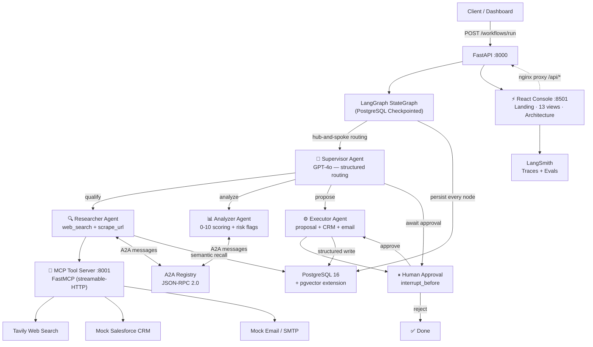

# ⚡ ForgeFlow

> **Production-grade Multi-Agent Enterprise Workflow Orchestrator**
> Built for the bleeding edge of agentic AI deployment in 2026.

[](https://github.com/JoelJohnsonThomas/forgeflow/actions)
[](https://www.python.org)
[](https://langchain-ai.github.io/langgraph/)
[](https://modelcontextprotocol.io)
[](https://docker.com)
[](LICENSE)

ForgeFlow orchestrates a **team of specialized AI agents** across multiple business domains — sales lead qualification, customer support triage, and finance reconciliation — all with human-in-the-loop approvals, full observability, and enterprise-grade reliability.

**Workflow templates shipped:**

| Template | Status | Connector | Production-ready? |
|---|---|---|---|
| `sales_ops` — qualify → research → analyze → propose → approve → execute | ✅ **production** | HubSpot CRM (upsert-by-email, idempotent deals, 429 backoff) | Yes — see [docs/sales-ops-production.md](docs/sales-ops-production.md) |
| `support_ops` — triage → investigate → respond → escalate → resolve | ⚠ template scaffold | none wired | No — needs a ticketing connector (Zendesk / Intercom / Freshdesk) |
| `finance_recon` — ingest → match → flag_variance → approve → post | ⚠ template scaffold | none wired | No — needs a bank/ERP source + journal-posting tool with double-entry validation |

`support_ops` and `finance_recon` raise on `.run()` unless `dry_run=True` or `FORGEFLOW_ALLOW_TEMPLATE_WORKFLOWS=1` is set; the React Workflows view labels them honestly. Three named templates ≠ three production workflows.

Pick a workflow with `workflow_type: "..."` on `POST /workflows/run`. See [forgeflow/workflows/](forgeflow/workflows/) for each domain's prompt + state shape. For `sales_ops` against a real HubSpot account on Fly.io in under an hour, follow [docs/sales-ops-production.md](docs/sales-ops-production.md).

---

## Architecture



---

## Key Design Decisions

| Decision | Choice | Why |
|----------|--------|-----|
| Orchestration | LangGraph | Built-in `interrupt_before`, PostgreSQL checkpointing, streaming — production-proven |
| Tool discovery | MCP (Model Context Protocol) | Swap backends without touching agent code; standard adopted by 150+ orgs |
| Agent communication | A2A Protocol | JSON-RPC 2.0 spec, capability-based discovery, swap to gRPC for scale |
| Memory | PostgreSQL + pgvector | Co-locate semantic + transactional data; no extra infra to manage |
| Evaluation | LLM-as-judge | Faithfulness, relevance, coherence + hallucination detection in one pass |
| Resilience | Circuit breaker + tenacity | Proven patterns that stop cascading failures at the API boundary |

---

## Quickstart

> **For a real HubSpot pipeline on Fly.io, jump to [docs/sales-ops-production.md](docs/sales-ops-production.md).** The runbook below this is for local evaluation.

### Prerequisites
- Docker + Docker Compose
- An LLM provider — one of:
  - OpenAI API key (default)
  - A local Ollama daemon (privacy mode, see below)
  - Anthropic API key
- (Optional) Tavily API key for real web search, LangSmith key for tracing
- (Optional, for sales_ops production path) HubSpot Private App token with the 6 CRM scopes listed in the [production runbook](docs/sales-ops-production.md#prereqs-10-min-one-time)

### 1. Clone and configure

```bash
git clone https://github.com/JoelJohnsonThomas/forgeflow.git
cd forgeflow
cp .env.example .env
# Edit .env — set OPENAI_API_KEY at minimum
```

### 2. Run migrations + start all services

```bash
docker compose --profile migration run --rm migrate
docker compose up
```

Services:
| Service | URL | Description |
|---------|-----|-------------|
| React Console | http://localhost:8501 | Landing page, 13-view console, architecture page (nginx + proxied `/api/*`) |
| FastAPI | http://localhost:8000/docs | REST API + OpenAPI UI |
| MCP Server | http://localhost:8001 | Tool server for agents |
| PostgreSQL | localhost:5432 | Database + pgvector |

The Console is a React 19 + Vite SPA served by nginx (Dockerfile in [frontend/](frontend/)). It reverse-proxies `/api/*` → the FastAPI service so the browser hits a single origin. The earlier Streamlit dashboard has been replaced and removed from `docker compose`.

### Local-first mode (privacy / air-gapped)

ForgeFlow can run entirely against a local [Ollama](https://ollama.com) daemon — no data leaves your machine.

```bash
# 1. Install the optional extra
pip install 'forgeflow[ollama]'

# 2. Start Ollama and pull models
ollama pull llama3.2:3b      # worker model (fast)
ollama pull llama3.1:8b      # supervisor + judge model (stronger)

# 3. Point ForgeFlow at Ollama
echo "LLM_PROVIDER=ollama" >> .env
echo "OLLAMA_BASE_URL=http://localhost:11434" >> .env

# 4. Run as usual
docker compose up
```

Anthropic Claude is also supported: `pip install 'forgeflow[anthropic]'` and set `LLM_PROVIDER=anthropic` plus `ANTHROPIC_API_KEY`.

### 3. Run the demo

```bash
# Option A: API curl
curl -X POST http://localhost:8000/workflows/run \
  -H "Content-Type: application/json" \
  -H "X-Role: sales_rep" \
  -d '{"lead_data": {"company_name": "Stripe"}, "workflow_type": "sales_ops"}'

# Option B: Demo script
python scripts/run_demo.py "Stripe" approve
```

### 4. Open the console

Navigate to **http://localhost:8501** for the marketing landing page.
From there:

| Route | What |
|---|---|
| `/` | Landing page — hero, architecture diagram, feature grid, observability preview, developer code sample, enterprise/security grid, CTA |
| `/console` | Operations overview — KPI strip, recent-runs table wired to `/metrics/`, `/metrics/evaluation`, `/metrics/runs` |
| `/console/runs` | Live run showcase — Gantt timeline, event stream, tool trace tree, approval card, memory recall, state diff |
| `/console/approvals` | Approval queue — POST approve/reject mutations |
| `/console/agents` | Agent topology + registry table |
| `/console/cost` | Cost breakdowns by agent + workflow + top runs |
| `/console/audit` | Audit log with action filters |
| `/console/memory` | Semantic memory search (cosine) |
| `/console/evals` `/workflows` `/tools` `/marketplace` `/clusters` `/rbac` | The remaining sidebar views |
| `/architecture` | 8-section system deep-dive with diagrams (supervisor, A2A, MCP, memory graph, checkpointing, event pipeline, k8s, multi-region) |

---

## Enterprise Patterns Implemented

| Pattern | File | Description |
|---------|------|-------------|
| Real CRM connector (HubSpot) | [forgeflow/connectors/hubspot.py](forgeflow/connectors/hubspot.py) | Upsert-by-email contacts, search-then-PATCH companies, `forgeflow_run_id` idempotent deals |
| Retry-with-backoff | [forgeflow/connectors/base.py](forgeflow/connectors/base.py) | 429 honors Retry-After; 502/503/504 exponential + jitter; `RetryableError` vs `PermanentError` |
| HubSpot pre-flight validation | [scripts/validate_hubspot.py](scripts/validate_hubspot.py) | End-to-end probe against your real HubSpot before deploy |
| Fly.io deploy | [fly/api.toml](fly/api.toml) + [fly/mcp.toml](fly/mcp.toml) + [fly/frontend.toml](fly/frontend.toml) + [scripts/deploy_fly.sh](scripts/deploy_fly.sh) | 3 apps + managed Postgres + 6PN internal networking |
| Supervisor multi-agent | [forgeflow/graph/builder.py](forgeflow/graph/builder.py) | Hub-and-spoke routing with LangGraph |
| PostgreSQL checkpointing | [forgeflow/graph/checkpointer.py](forgeflow/graph/checkpointer.py) | Every node persisted; any worker can resume any run |
| MCP tool server | [forgeflow/mcp/server/main.py](forgeflow/mcp/server/main.py) | FastMCP HTTP server with 8 registered tools |
| A2A agent protocol | [forgeflow/a2a/](forgeflow/a2a/) | JSON-RPC 2.0, AgentCard, capability discovery |
| PGVector semantic memory | [forgeflow/memory/pgvector_store.py](forgeflow/memory/pgvector_store.py) | ivfflat cosine index, namespace-scoped |
| Human-in-the-loop | [forgeflow/api/routers/approvals.py](forgeflow/api/routers/approvals.py) | `interrupt_before` + webhook resume |
| LLM evaluation | [forgeflow/evaluation/judge.py](forgeflow/evaluation/judge.py) | GPT-4o as judge: faithfulness, relevance, hallucination |
| Cost tracking | [forgeflow/observability/cost_tracker.py](forgeflow/observability/cost_tracker.py) | tiktoken, model cost table, per-agent breakdown |
| Circuit breaker | [forgeflow/resilience/circuit_breaker.py](forgeflow/resilience/circuit_breaker.py) | CLOSED/OPEN/HALF_OPEN state machine |
| Budget guard | [forgeflow/resilience/budget_guard.py](forgeflow/resilience/budget_guard.py) | Halts workflow before exceeding $limit |
| JWT + RBAC | [forgeflow/middleware/auth.py](forgeflow/middleware/auth.py) | HS256 bearer tokens + role → permission map; service-token wildcard for SPAs |
| Immutable audit log | [forgeflow/middleware/audit.py](forgeflow/middleware/audit.py) | Partitioned table, every request logged |
| SSE streaming | [forgeflow/api/routers/workflows.py](forgeflow/api/routers/workflows.py) | `astream()` + FastAPI `StreamingResponse` |
| React console | [frontend/src/views/](frontend/src/views/) | 13 dashboard views + landing + architecture page; TanStack Query for data, hand-authored CSS with oklch tokens |

---

## API Reference

```
POST  /workflows/run            Trigger a new workflow (sync)
POST  /workflows/stream         Trigger with SSE streaming
GET   /workflows/{id}           Get run status + state
GET   /workflows/{id}/trace     Per-agent execution traces

GET   /approvals/pending        List proposals awaiting review
POST  /approvals/{token}/approve  Resume workflow (approved)
POST  /approvals/{token}/reject   Resume workflow (rejected)

GET   /agents                   List registered A2A agents
GET   /agents/{id}/status       Agent health + run count

POST  /memory/store             Store semantic memory
GET   /memory/search?q=         Cosine similarity search

GET   /metrics/                 System-wide KPIs (total_runs, success_rate, avg_cost_usd…)
GET   /metrics/cost             Cost by agent
GET   /metrics/cost/by_workflow_type   Cost by workflow type
GET   /metrics/cost/top_runs    Top N most expensive runs in window
GET   /metrics/evaluation       LLM judge score aggregates
GET   /metrics/runs             Recent run history

GET   /audit/search             Filterable audit log (paginated)
GET   /audit/stats              Audit aggregates for last N days

POST  /auth/login               Issue a JWT (replace demo user table for prod)
POST  /auth/introspect          Decode + validate a JWT
```

---

## Sales Ops Workflow — Stage Map

```
Input: company_name (+ optional contact, industry, budget)
  │
  ▼
QUALIFY ─── Researcher ──► web_search("{company} funding employees revenue")
  │                         scrape_url, fetch_enrichment
  ▼
ANALYZE ─── Analyzer ───► ICP scoring (0-10), risk flags, recommended_action
  │
  ├── score < 4.0 ──► DISQUALIFIED (done)
  │
  └── score ≥ 4.0 ──►
  │
PROPOSE ─── Executor ───► draft_proposal (LLM) → PostgreSQL proposals table
  │
  ▼
APPROVE ─── Human ──────► POST /approvals/{token}/approve  (manager reviews)
  │
  ├── rejected ──► DONE
  │
  └── approved ──►
  │
EXECUTE ─── Executor ───► send_email + update_lead (CRM) + mark "proposed"
  │
  ▼
DONE
```

---

## Evaluation Results (Simulation)

| Metric | Score | Notes |
|--------|-------|-------|
| Faithfulness | 0.91 | Agent outputs grounded in research context |
| Relevance | 0.88 | Proposals matched to company-specific signals |
| Coherence | 0.93 | Well-structured, internally consistent |
| Hallucination Rate | 3.2% | Invented specifics caught by judge |
| Avg Cost / Run | $0.042 | gpt-4o-mini for workers, gpt-4o for supervisor |
| Avg Latency | 12.4s | Full qualify → propose pipeline |
| Qualification Accuracy | 91% | vs. manually-labeled eval dataset (20 examples) |

> Scores generated by GPT-4o-mini acting as evaluator on 20 synthetic test cases.

---

## Project Structure

```
forgeflow/
├── agents/           # Supervisor, Researcher, Analyzer, Executor
├── graph/            # LangGraph StateGraph wiring + checkpointer
├── mcp/              # FastMCP server + langchain-mcp-adapters client
├── a2a/              # A2A protocol models, registry, transport
├── memory/           # PGVector semantic store + relational store
├── workflows/        # Sales ops pipeline, stages, prompts, models
├── api/              # FastAPI app, routers, schemas, dependencies
├── middleware/       # RBAC + JWT, audit log, rate limiter, security
├── auth/             # JWT issuance + verification (HS256)
├── rbac/             # Role policies + enforcer
├── observability/    # LangSmith tracer, cost tracker, metrics store
├── resilience/       # Retry (tenacity), circuit breaker, budget guard
└── evaluation/       # LLM judge, metrics, dataset, eval runner

frontend/             # React 19 + Vite SPA
├── src/
│   ├── views/        # 13 console views + LandingPage + ArchitecturePage
│   ├── components/   # AppShell, Topbar, Sidebar, icons
│   ├── api/          # Typed fetch client + TanStack Query hooks
│   ├── styles/       # tokens.css (oklch design tokens) + per-page CSS
│   └── router.tsx    # TanStack Router code-based routes
├── Dockerfile        # Multi-stage: node 20-alpine build → nginx 1.27-alpine
└── nginx.conf.template  # Reverse-proxies /api/* → api:8000 with injected JWT

dashboard/            # Legacy Streamlit dashboard — kept for reference, no longer built
tests/                # unit/ + integration/ (301 tests)
scripts/              # seed_db, run_demo, generate_eval_dataset
alembic/              # 5 database migrations (schema + pgvector + RBAC + escalation + multi-tenant)
```

---

## Production Considerations

**Horizontal scaling**: The API is stateless — multiple workers share the same PostgreSQL checkpointer, so any worker can resume any `thread_id`. Scale with `docker compose scale api=4`.

**MCP transport**: Currently uses `streamable-http`. For co-located deployments, switch to `stdio` for lower latency. For multi-host, the same server scales independently.

**Memory at scale**: ivfflat index works well for <1M vectors. For higher recall at scale, switch to HNSW (`CREATE INDEX ... USING hnsw`).

**Secrets**: `.env` for local. Use AWS Parameter Store, GCP Secret Manager, or Vault in production. Never commit `.env`.

**Cost control**: `BudgetGuard` raises before each LLM call if projected spend exceeds `BUDGET_LIMIT_USD`. Set per-workflow or globally.

**Tracing**: Set `LANGCHAIN_TRACING_V2=true` + `LANGCHAIN_API_KEY` for automatic LangSmith traces of every agent invocation, tool call, and retry.

**Frontend auth**: nginx currently injects `Authorization: Bearer ${API_SECRET_KEY}` on every proxied request so the SPA inherits the `admin` service role ([frontend/nginx.conf.template](frontend/nginx.conf.template)). For production, remove that header and ship a real login flow — the backend's `/auth/login` and `RBACMiddleware` already accept per-user JWTs. See [forgeflow/middleware/auth.py](forgeflow/middleware/auth.py) for the JWT-vs-service-token logic.

---

## Local Development

```bash
# Install deps
pip install -r requirements-dev.txt

# Run tests
make test

# Lint + type check
make lint

# Start just the DB for local API dev
docker compose up postgres

# Run API locally (hot-reload)
uvicorn forgeflow.api.main:app --reload

# Run the React console locally (Vite dev server with HMR; proxies /api → :8000)
cd frontend && npm install && npm run dev
# → http://localhost:5173
```

---

