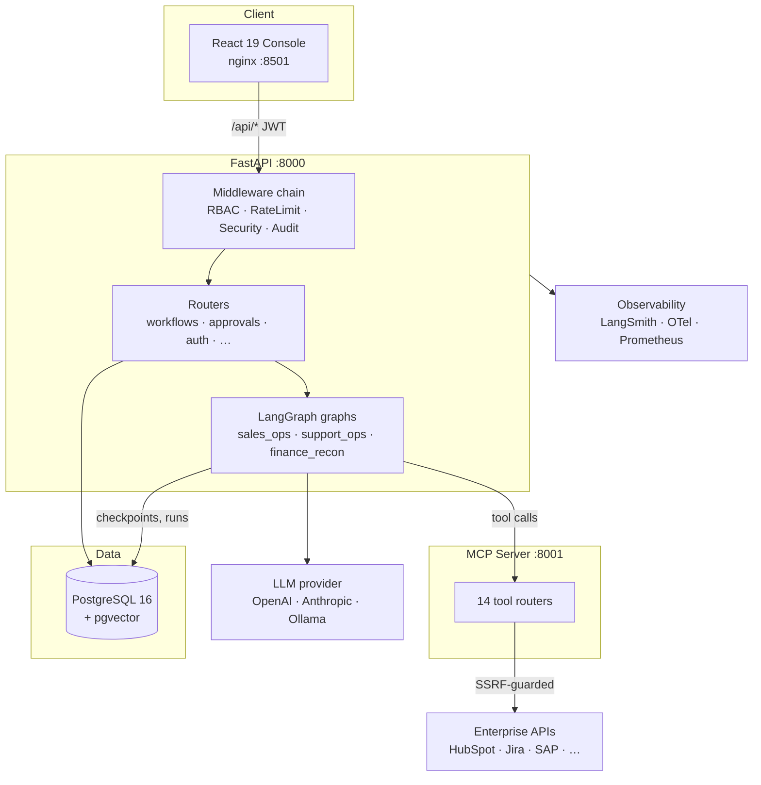
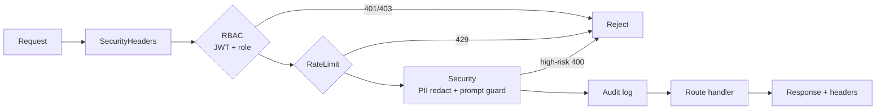
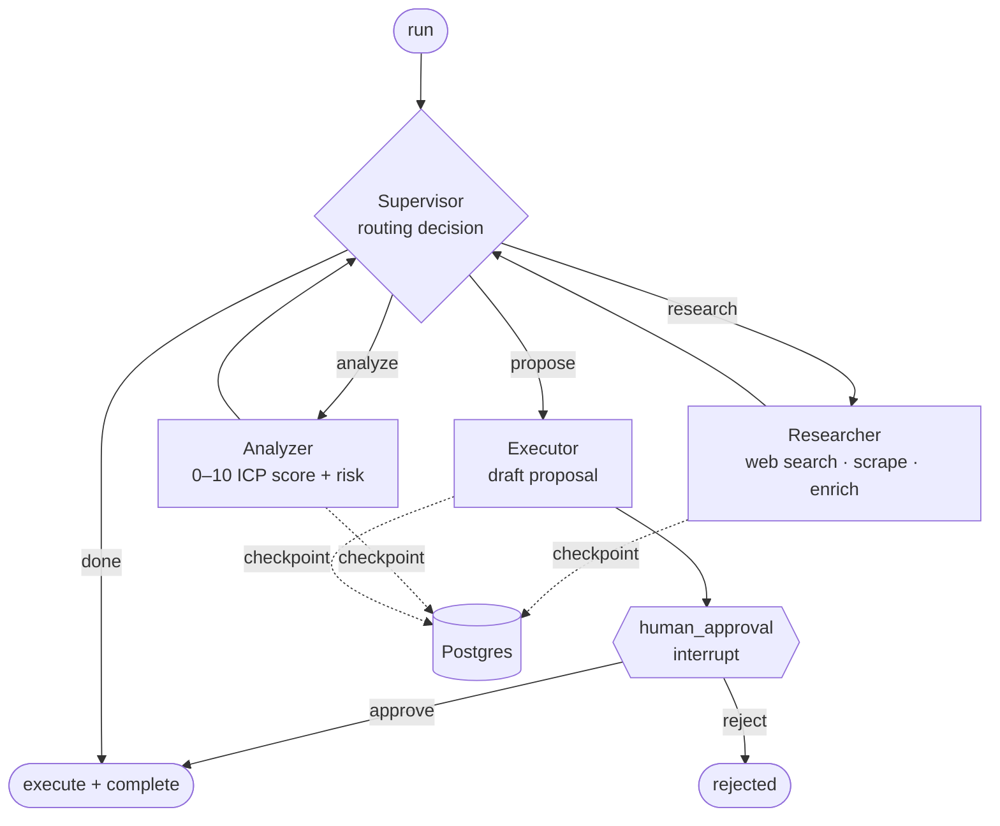
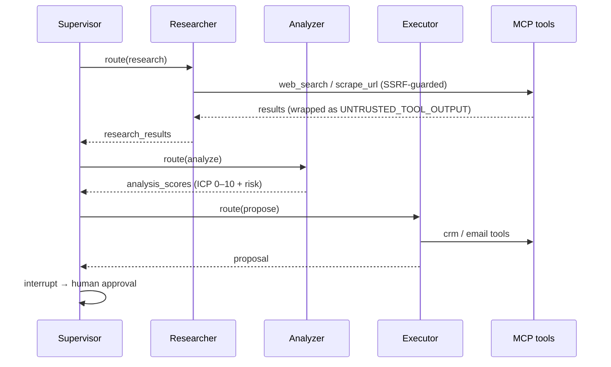
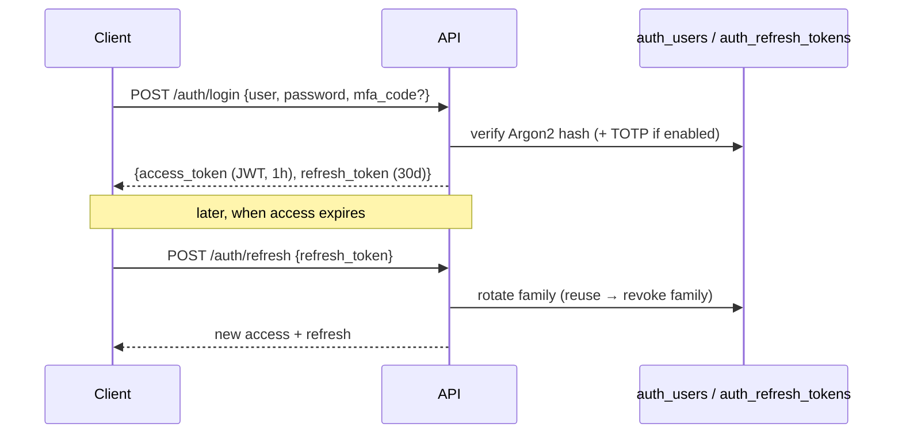
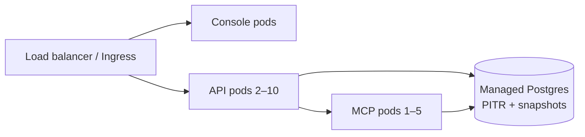

# Architecture

ForgeFlow orchestrates a **supervisor multi-agent system** behind a FastAPI
service, with durable state in PostgreSQL and tools exposed over the Model
Context Protocol (MCP). This page explains how the pieces fit together, with
diagrams.

## High-level components

- **Console** — React SPA served by nginx; talks to the API with a per-user JWT.
- **API** — stateless; the middleware chain authenticates + guards every request,
  routers dispatch to compiled LangGraph graphs.
- **Graphs** — one compiled `StateGraph` per workflow type, checkpointed to
  Postgres so any worker resumes any `thread_id`.
- **MCP server** — exposes connectors + utilities as tools; every outbound URL is
  SSRF-guarded.
- **PostgreSQL** — the only stateful component (runs, approvals, memory, auth,
  checkpoints). See [database.md](database.md).

## API request lifecycle

Middleware runs outermost-first on the request, reverse on the response:

- **SecurityHeaders** — HSTS/CSP/XFO/etc. on every response (incl. errors).
- **RBAC** — verifies the bearer JWT, maps `(method, path)` → permission
  (longest-prefix, deny-by-default). No header fallback — fail closed.
- **RateLimit** → **Security** (PII redaction + prompt-injection scan) → **Audit**
  (append-only log) → handler.

## Workflow execution (the `sales_ops` graph)

The **supervisor** emits a structured `RoutingDecision` (it never calls tools
directly), keeping routing deterministic and auditable. Every node is
checkpointed; at `human_approval` the graph **interrupts** and persists — a later
`/approvals/{token}/approve` resumes from the checkpoint. `dry_run` executes the
full LLM plan but skips side effects.

## Agent lifecycle & A2A

Agents also expose an **A2A** (Agent-to-Agent) interface — JSON-RPC 2.0 with
`AgentCard` capability discovery and an in-workflow dispatch registry
([`forgeflow/a2a/`](../forgeflow/a2a/)), so nodes can be deployed out-of-process.

## Authentication flow

Production fronts the API with an OIDC IdP via `/auth/oidc/exchange` (RS256/JWKS
verification + JIT provisioning). Full model: [auth.md](auth.md).

## Key design decisions

| Decision | Why |
|---|---|
| Supervisor emits routing, never calls tools | Deterministic, auditable control flow |
| Postgres checkpointer | Crash-safe, horizontally scalable resume |
| Tools over MCP | Swap a mock connector for a real one without touching agent code |
| Tool output wrapped `UNTRUSTED_TOOL_OUTPUT` | Blunts 2nd-order prompt injection |
| Connectors degrade to mocks | Demos/CI run without real credentials |
| Fail-closed RBAC + startup validation | Insecure configs can't serve traffic |

## Deployment topology

See the [deployment section](../README.md#-deployment) and
[backup-dr.md](operations/backup-dr.md).
