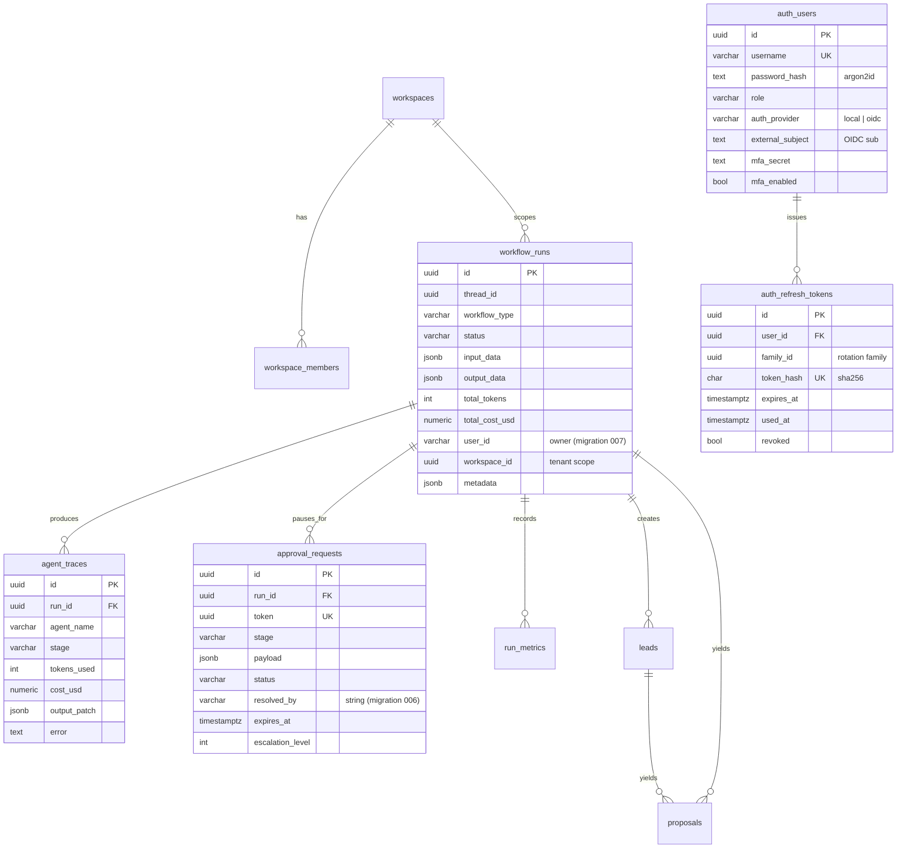

# Database

ForgeFlow uses a single **PostgreSQL 16** database (with the `pgvector`
extension) as its source of truth. Schema is managed by Alembic; the LangGraph
checkpointer manages its own `checkpoint*` tables.

## Entity relationships (core domain)

## Table groups

### Workflow execution (the hub)
- **`workflow_runs`** — one row per run: type, status, token/cost totals, owner
  (`user_id`, a string since migration 007), tenant (`workspace_id`), and a
  `metadata` JSONB. Everything below references it by `run_id`.
- **`agent_traces`** — per-agent execution records (prompts/output patch, tokens,
  cost, error) for the run timeline.
- **`approval_requests`** — the human-in-the-loop queue: a `token`, the proposal
  `payload`, `status` (`pending`/`approved`/`rejected`), `resolved_by` (a string
  since migration 006), `expires_at`, and escalation fields (migration 004).
- **`run_metrics`** — time-series metric samples per run.

### Sales domain
- **`leads`**, **`proposals`** — sales-ops entities produced by a run
  (`proposals.lead_id` → `leads`).

### Auth (migration 009)
- **`auth_users`** — Argon2id password hashes, role, OIDC link, TOTP secret.
- **`auth_refresh_tokens`** — hashed refresh tokens with a `family_id` for
  rotation + reuse detection.

### Multi-tenancy (migration 005)
- **`workspaces`**, **`workspace_members`** — tenant roots and membership.
  Tenant-scoped tables carry a nullable `workspace_id`.

### Memory (migration 002, pgvector)
- **`memory_vectors`** — embeddings + payload, `ivfflat` cosine index.
- **`agent_knowledge`** — agent knowledge base with a GIN full-text index.

### Audit (migration 003, partitioned)
- **`audit_log`** with yearly partitions (`audit_log_2025`, `audit_log_2026`) —
  append-only; indexed by timestamp, user, and resource.

### LangGraph checkpointer (self-managed)
- **`checkpoints`**, `checkpoint_blobs`, `checkpoint_writes`,
  `checkpoint_migrations` — created and owned by LangGraph's Postgres
  checkpointer. **Do not hand-edit.** This is what lets any worker resume any
  `thread_id`.

### Legacy DB-RBAC (migration 003, not used by the runtime)
- **`users`**, `roles`, `permissions`, `role_permissions` — an earlier
  database-backed RBAC design. The running middleware uses the in-code policy
  matrix in [`forgeflow/rbac/policies.py`](../forgeflow/rbac/policies.py); these
  tables are retained but inert. (This is why the auth tables are namespaced
  `auth_*` — see migration 009.)

## Migrations

Alembic, applied in order. Run all with:
`docker compose --profile migration run --rm migrate` (`alembic upgrade head`).

| Rev | Adds |
|---|---|
| `001` | Initial schema (`workflow_runs`, `agent_traces`, `approval_requests`, `leads`) |
| `002` | pgvector memory (`memory_vectors`, `agent_knowledge`) |
| `003` | Audit log (partitioned) + DB-RBAC tables + `run_metrics` |
| `004` | Approval escalation fields |
| `005` | Multi-tenancy (`workspaces`, `workspace_members`, `workspace_id` columns) |
| `006` | `approval_requests.resolved_by` UUID → VARCHAR |
| `007` | `workflow_runs.user_id` UUID → VARCHAR (attributable owner) |
| `008` | Performance indexes (`user_id`, `(workspace_id,status,created_at)`, `approval_requests.run_id`) |
| `009` | Enterprise auth (`auth_users`, `auth_refresh_tokens`) |

Each migration has a reversible `downgrade()`. See
[`alembic/versions/`](../alembic/versions/).

## Indexes (highlights)

- `workflow_runs`: `thread_id`, `status`, `user_id`, `(workspace_id, status, created_at DESC)`
- `approval_requests`: `token`, `status`, `run_id`, partial pending-age index
- `memory_vectors`: `ivfflat` cosine; `agent_knowledge`: GIN FTS
- `audit_log`: `timestamp DESC`, `user_id`, `(resource, resource_id)`
- `auth_refresh_tokens`: `family_id`, `user_id`, unique `token_hash`

## Backups

Postgres is the only stateful component — see
[operations/backup-dr.md](operations/backup-dr.md).
